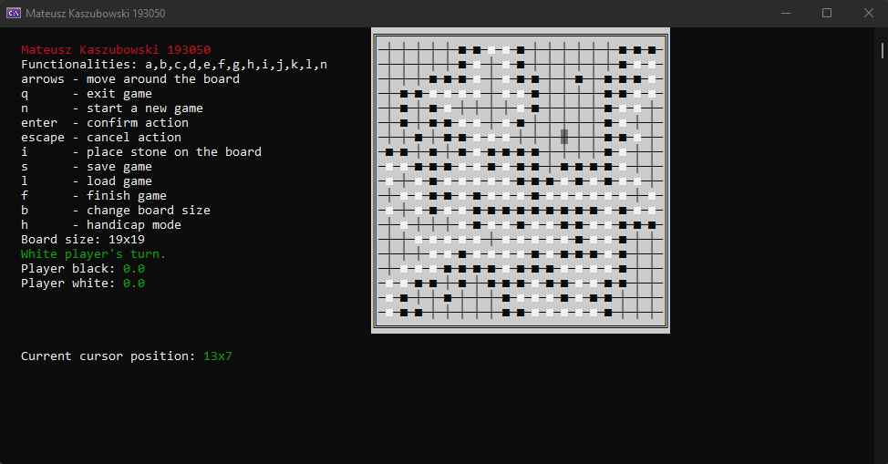

# The game of Go

Go is an abstract strategy board game for two players in which the aim is to surround more territory than the opponent. The simplified rules are:
- Game is played on square boards with 19 lines crossing the board horizontally and 19 lines crossing the board vertically (361 intersections)
- Players put black and white stones on the intersections, one stone at the time. Black player starts
- Goal is to surround the largest surface on the board using your own stones
- A stone that was put on the board stays there unless it is captured
- Stone is captured when it is surrounded by either stones of a opposing color or edge of the board
- Free sides are called liberties, e.g. a stone that is surrounded by two stones of a opposing colour has two liberties
- Players can't put suicide stones on the board. It it possible if and only if it leads to one of the opponent's stones being captured
- The Ko rule has to be kept – stones on the board can't repeat a previous position. Moves leading to that are forbidden that turn

## Library
The project uses conio.h library for semi-graphic interface in console

## Functionalities
- Creating games of any board size
- Game saving / loading
- Forcing the Ko rule
- Capturing both single stones and the ones in chains
- Game state editor - configuration of black stones on board before the game starts
- Scoring (Japanese variant)
- Marking stones with one liberty left
## Exemplary gameplay

